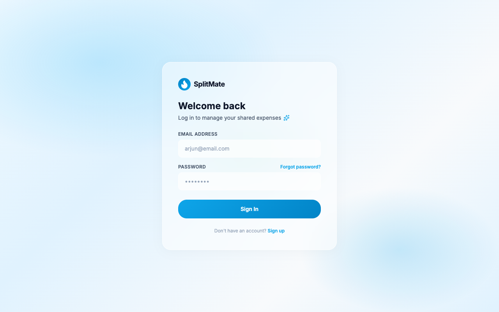
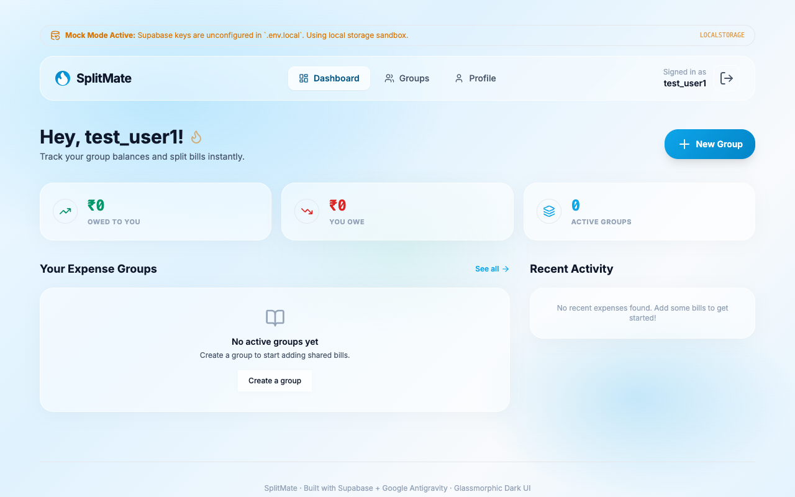
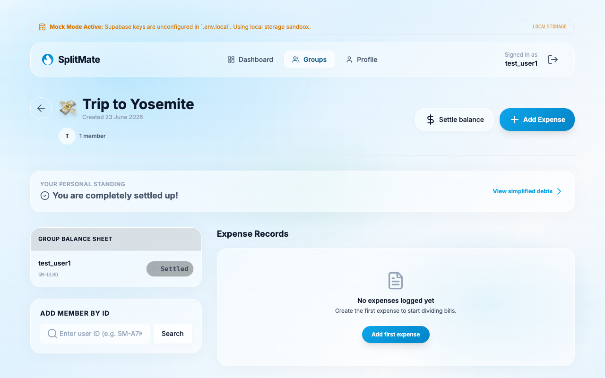

# 🔵 SplitMate — Premium Splitwise Replacement

SplitMate is a modern, full-stack split-wise replacement designed with a premium, frosted **Sky Light Blue** glassmorphic aesthetic. Instead of phone numbers or email addresses, SplitMate protects user privacy by utilizing a unique 6-character user ID code (`SM-XXXX`) for group invitations and search lookup.

**Production URL**: [https://cerulean-sprinkles-e14a1a.netlify.app](https://cerulean-sprinkles-e14a1a.netlify.app)

## 📸 Screenshots

<p align="center">
  
  <br />
  <em>Login Page &mdash; Beautiful glassmorphic credentials portal.</em>
</p>

<p align="center">
  
  <br />
  <em>Dashboard &mdash; Owed/owe summaries, recent activities, and groups list.</em>
</p>

<p align="center">
  
  <br />
  <em>Group Details &mdash; Balance sheet list, transaction logs, and inline friend additions by unique Split ID.</em>
</p>

---

## 🌟 Key Features

1. **Unique ID Badges (`SM-XXXX`)**: Invite friends securely using custom codes rather than revealing phone numbers or emails.
2. **Dynamic Group Creation**: Create groups with customizable names and emojis, and add members directly by searching their code.
3. **Advanced Splitting Options**: Add expenses and split them equally, by exact percentages, or by custom exact amounts.
4. **Receipt Attachment (Supabase Storage)**: Drag-and-drop receipt file upload (JPG, PNG, PDF) with secure signed URL token links.
5. **Greedy Debt Simplification**: A transaction-minimizer algorithm that simplifies outstanding balances within any group to settle debts in the fewest payments possible.
6. **Frictionless Mock Sandbox**: Auto-detects configuration status and falls back to a full client-side mock database in LocalStorage if Supabase credentials are not configured.

---

## 🧪 Verified Accounts for Testing

We have pre-configured two test user accounts to help you test splits and debt simplification.

- **Test User 1**:
  * **Email**: `test_user1@splitmate.com`
  * **User ID Code**: `SM-JXP2`
- **Test User 2**:
  * **Email**: `test_user2@splitmate.com`
  * **User ID Code**: `SM-ZLHM`

🔒 **Passwords & Access**:
To get the testing passwords or to set up custom verified accounts, please contact **saisreenath1819@gmail.com** directly. New signups are subject to Supabase free-tier email rate limiting, so manual verification or password access is provided upon request.

---

## 💻 Local Setup & Development

### 1. Clone the project
```bash
git clone https://github.com/Sai-Sreenath-1819/splitmate.git
cd splitmate
```

### 2. Configure environment variables
Create a `.env.local` file in the project root:
```env
VITE_SUPABASE_URL=https://your-project-ref.supabase.co
VITE_SUPABASE_ANON_KEY=your-supabase-anon-key
```
*(You can use the values in `.env.example` as a template).*

### 3. Install dependencies and start development server
```bash
npm install
npm run dev
```
Open **`http://localhost:5173`** (or the port specified in terminal) in your browser.

---

## 🚀 Deployment Config
The project is configured to deploy directly to Netlify using the custom build pipeline configured in [netlify.toml](file:///Users/sreenath/.gemini/antigravity/scratch/splitmate/netlify.toml):
* **Build Command**: `npm run build`
* **Publish Folder**: `dist`
* **SPA Redirection**: Custom redirects are established to direct `/*` traffic to `/index.html` so client-side routing functions correctly on page refreshes.
